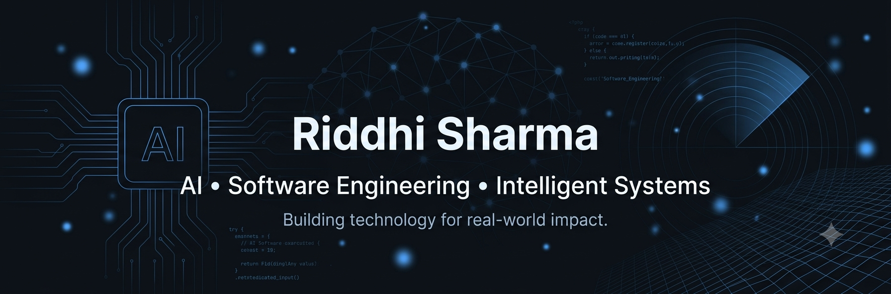
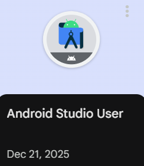
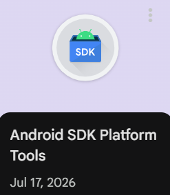
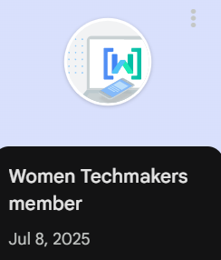

<h1 align="center">
Turning research into real-world technology
</h1>

<h3 align="center">
Artificial Intelligence • Software Engineering • Research
</h3>

## 🤝 Let's Connect

---

## 👨‍💻 About Me

- 🎓 Final Year B.Tech Computer Science student at **Mody University**
- 💼 Software Engineering Intern @ **Coforge** (Shared Services Department)
- 🧠 Building AI-powered solutions across healthcare, intelligent systems, and automation
- 🔬 Research interests: Artificial Intelligence, Signal Processing, NLP, and Defence Technology
- 📄 Published author in **JETIR**
- 🎖️ NCC 'C' Certificate holder with leadership and team coordination experience
- 🌱 Currently working with Flutter, FastAPI, Python, React, and Machine Learning
---
## 🚀 Current Focus

- 🧠 Developing AI-powered healthcare solutions through **NuroLab**
- 💼 Software Engineering Intern @ **Coforge** (Shared Services Department)
- 📚 Exploring **LLMs, Signal Processing, Flutter & FastAPI**
- 🛡️ Researching AI applications in **Healthcare** and **Defence Technology**

## 🚀 Featured Projects

<table>
<tr>
<td width="50%">

### 🧠 NuroLab
EEG-powered cognitive wellness platform combining AI, signal processing, and Flutter.

</td>

<td width="50%">

### ♿ Aura
Accessibility-focused Chrome extension designed to enhance digital reading experiences.

</td>
</tr>

<tr>
<td width="50%">

### 🤖 Aegis Swarm
Multi-agent AI simulation for autonomous defence coordination.

</td>

<td width="50%">

### 📡 Radar Signal Processor
Python toolkit for radar signal processing and visualization.

</td>
</tr>
</table>

---
## 📚 Research

📄 **Aerial Defense Systems: Strategic Shielding in Modern Warfare**

Published in **JETIR (2025)**

🚀 **Current Research**

- AI-assisted EEG Analysis
- Cognitive Readiness Assessment
- Defence AI
- Intelligent Signal Processing

## 💻 Tech Stack

---
## 🌱 Currently Learning

- 🤖 Large Language Models (LLMs)
- 📱 Flutter & Cross-Platform Development
- ⚡ FastAPI & Backend Engineering
- 🧠 Advanced Machine Learning
- ☁️ Cloud & DevOps Fundamentals

## 🏆 Achievements

- 🎖️ NCC 'C' Certificate
- 💼 Software Engineering Intern @ Coforge
- 📄 Published Research in JETIR
- 🌐 Google Developer Program Member
- 👩‍💻 Women Techmakers Member

---
## 🏅 Google Developer Badges

  
  
  
  

> *"Curiosity drives innovation. Engineering turns it into reality."*

## 📊 GitHub Analytics

  
  

  

## 📈 Contribution Graph

  

---

<i>"Code with purpose. Build with impact."</i>

